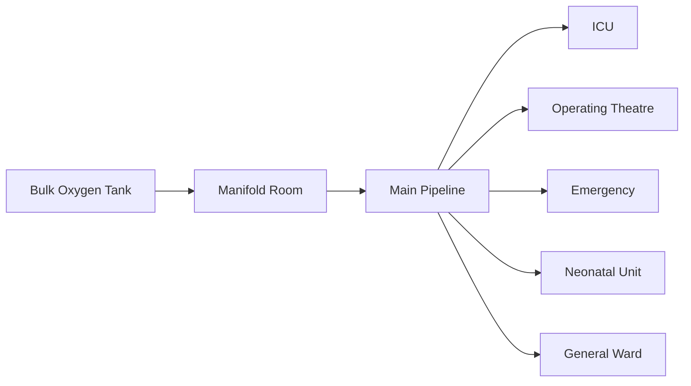

# Hospital oxygen pipeline monitoring layout

## Sensor deployment

Pressure sensors are installed at:

* tank outlet
* manifold outlet
* main pipeline
* ICU branch
* theatre branch
* neonatal branch

Flow sensors are installed on major distribution branches to measure ward-level oxygen consumption.
