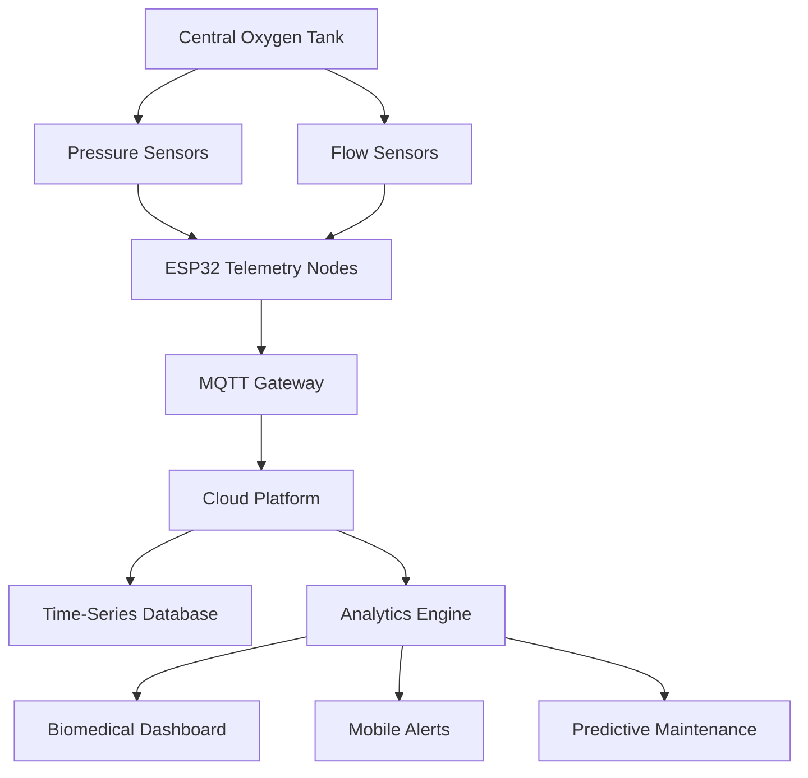

# OxyTrack system overview

## Overview

The OxyTrack platform transforms hospital oxygen infrastructure into a distributed telemetry network that continuously monitors pressure, flow, and infrastructure health.
