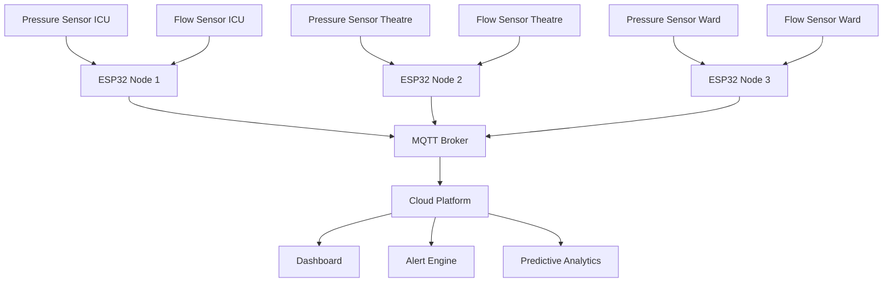

# OxyTrack telemetry network

```mermaid
flowchart TD
    P1[Pressure Sensor ICU]
    P2[Pressure Sensor Theatre]
    P3[Pressure Sensor Ward]

    F1[Flow Sensor ICU]
    F2[Flow Sensor Theatre]
    F3[Flow Sensor Ward]

    P1 --> E1[ESP32 Node 1]
    F1 --> E1

    P2 --> E2[ESP32 Node 2]
    F2 --> E2

    P3 --> E3[ESP32 Node 3]
    F3 --> E3

    E1 --> M[MQTT Broker]
    E2 --> M
    E3 --> M

    M --> C[Cloud Platform]
    C --> D[Dashboard]
    C --> A[Alert Engine]
    C --> PM[Predictive Analytics]
```

## Network characteristics

* distributed sensor architecture
* MQTT communication
* cloud synchronization
* real-time analytics
* automated alert generation
